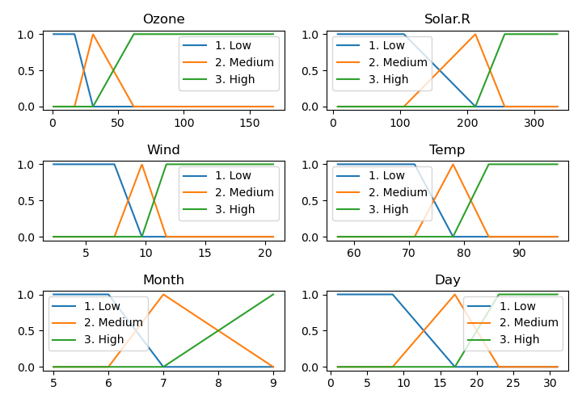
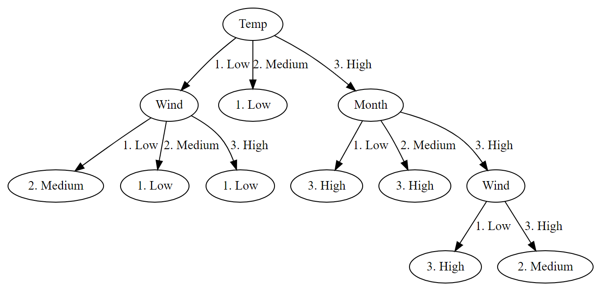

# Fuzzy Classifier

A Fuzzy Tree Algorithm for classification based on the publication:

Yuan, Yufei, & Michael J. Shaw. "Induction of fuzzy decision trees". Fuzzy Sets and Systems 69, n.º 2 (27th January 1995): 125-39. doi:10.1016/0165-0114(94)00229-Z.

## Installation

Write in the console (in the same folder you download the code)

```python
python setup.py install
```

## Use

To build a FuzzyTree classifier you need to fuzzify the variables of use and then create the tree.

With the code you download a database of air quality. It is a subset of the database (<https://stat.ethz.ch/R-manual/R-devel/library/datasets/html/airquality.html>)

You can load the database
```python
import pandas as pd
data = pd.read_csv("./demo/airquality.csv", index_col=0)
```

### Fuzzification

To do the fuzzification you need to have some criteria and providing names to each of the levels.

```python
from FuzzyTree import *

#%% Vars in the file
variables = list(data.keys())


#%% Names of the vars
# LHS stands for Left Hand Side: Predictors
# RHS stands for Right Hand Side: Predicted

varRHS = variables[1:5]
varLHS = variables[0]

#%% Fuzzification
fnVars = {}  # Dictionary of fuzzification functions
fvVars = {}  # Dictionary of fuzzified variables

levels = ["1. Low", "2. Medium", "3. High"]

for v in  variables:
    fnVars[v], fvVars[v] = percentile_partition(data[v], v, levels)
```

There are other strategies implemented to do the fuzzification

* Crisp fuzzification (for crisp variables): *crisp_partition*
* To split in determined points: *points_partition*

Other strategies can be implemented through the class *Fuzzification*.

In our case, all six variables are fuzzified as following



### Creating the tree

To create a tree, you are required to provided an object FuzzySet and the Beta and Alpha parameters for the tree.
(These parameters are explained in Yuan and Shaw (1995)

* Beta : Threshold level of truthness to become a Leaf
* Alfa : Minimum activation for reliable evidence

```python
Beta = 0.8
Alpha = 0.8
ft = FuzzyTree(fs, Beta, Alpha, varRHS, varLHS)
```

### Output

There are several outputs for the FuzzyTree classifier.

* The rules for classification
* The confussion matrix
* A graphviz dot graphic

#### The rules

The rules for classification are obtained printing the FuzzyTree object.

```python
print(ft)
```

Wich in the example produces the output:

```
IF (Temp==2. Medium)  THEN (Ozone==1. Low): 0.476572
IF (Temp==1. Low) AND (Wind==1. Low)  THEN (Ozone==2. Medium): 0.733521
IF (Temp==1. Low) AND (Wind==2. Medium)  THEN (Ozone==1. Low): 0.922673
IF (Temp==1. Low) AND (Wind==3. High)  THEN (Ozone==1. Low): 0.803221
IF (Temp==3. High) AND (Month==1. Low)  THEN (Ozone==3. High): 0.576805
IF (Temp==3. High) AND (Month==2. Medium)  THEN (Ozone==3. High): 0.802835
IF (Temp==3. High) AND (Month==3. High) AND (Wind==1. Low)  THEN (Ozone==3. High): 0.823128
IF (Temp==3. High) AND (Month==3. High) AND (Wind==3. High)  THEN (Ozone==2. Medium): 0.690558
```


### The confussion matrix

FuzzyTree is able to print the confussion matrix of a given FuzzySet.

```python
ft.confussion_matrix(fvVars[varLHS], fs)
```

This produces the following output

```
Ozone   1. Low  2. Medium       3. High
1. Low  42.0    18.0    5.0
2. Medium       1.0     4.0     0.0
3. High 3.0     4.0     30.0
```


#### The GraphViz dot graphic

The figure of the tree can be sent to a [.dot](https://graphviz.org/doc/info/output.html#d:dot) file

```python
ft.output_to_dot_graphviz('./the_file_name.dot')
```

Which produces the output




# Dependencies

This library requires numpy
